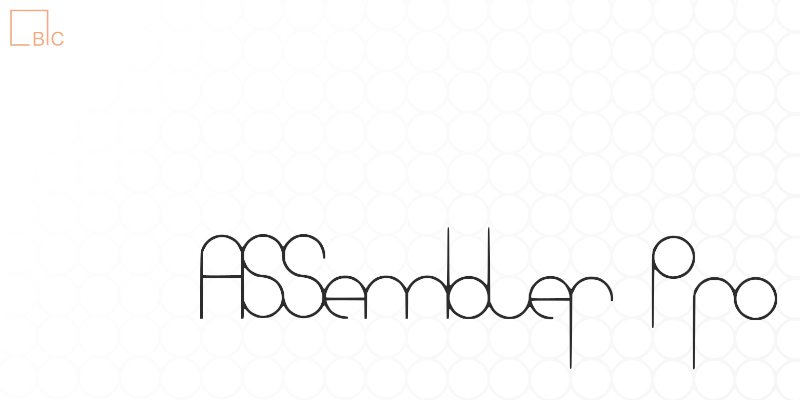

# AssemblerPro



AssemblerPro is an application built on the ALBA framework, designed to generate databases of surgical prostheses. These databases are intended for use in surgical planning applications or research requiring prosthetic surface data. The generated databases can be imported using ALBA's Prostheses Manager.

## Features

- **Import of Prosthetic Models**: Supports importing prosthetic models in various formats, including STL, PLY, and VTK.
- **Creation of Modular Prosthesis Databases**: Allows the generation of modular prosthesis databases, adaptable to specific surgical needs.

## Quick Start Guide

### 1. Clone the Repository
```bash
git clone https://github.com/IOR-BIC/AssemblerPro.git
```

### 2. Build the Application
- Navigate to the project directory.
- Use CMake to configure the project.
- Compile the source code with your preferred compiler.

### 3. Run AssemblerPro
- Execute the compiled application.
- Use the graphical interface to import prosthetic models and create databases.

## Dependencies

AssemblerPro is based on the ALBA framework. Ensure all required dependencies are installed and properly configured before building the application.

## License

This software is distributed WITHOUT ANY WARRANTY; without even the implied warranty of MERCHANTABILITY or FITNESS FOR A PARTICULAR PURPOSE. See the [LICENSE](LICENSE) file for more details.

---

For more information and updates, visit the [AssemblerPro GitHub repository](https://github.com/IOR-BIC/AssemblerPro).

